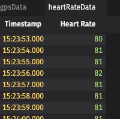

# strava

This example is meant to work alongside your Deephaven IDE. Please see our [QuickStart Guide]](https://deephaven.io/core/docs/tutorials/quickstart/). 

Maybe you're training for a race or simply maintaining an exercise routine. Personally, I consistently use my fitness watch to ensure I'm meeting my step goals and to track my progress as I try to shave a few seconds off my mile time. The free [Strava](https://www.strava.com) app beloved by runners and cyclists is another great resource to motivate you in your fitness journey and connect with a community. You can track a variety of exercises and store your results in the app. Did you know you can also download this data as .fit files?

We walk you through (pun intended!) downloading your Strava data and importing it into Deephaven Community Core, where you can get an overview of your performance and even use this information to adjust your routine for more health benefits.

## Grab your data

I'm a big fan of being able to analyze my data, and I'd rather have the tools to do so on my own when possible. Whether you use Strava's free app or upgrade to their Summit version, you can import your fitness data into Deephaven and access a powerful suite of data analysis options.

To follow along, make sure you've got Deephaven up and running. See our [Quickstart](/core/docs/tutorials/quickstart/#set-up-your-deephaven-deployment) if you're a new user.

First, pull your own data from your [Strava](https://www.strava.com/) account. 

1. Login to your Strava account.
2. Select an activity.
3. At the bottom of the menu, select **...** for more.
4. Select **Export Original**. Provided you have supplied the data in FIT format, this should now provide a file to download with the `.fit` extension.
5. Put this `.fit` file in the data folder underneath your Docker starting location. You might also want to create a new folder to organize the data. Ours is in `data/Fit`.

## Import your data


@dtcooper wrote a really cool Python script to read the FIT binary file format. To install that script, run this code inside the IDE:

```python
import os
os.system("pip install fitparse")
```

To read the FIT file into Deephaven, specify the file path, making sure to include any intermediate directory if you have them. Our example file is called `ThursMorn.fit`.

```python
from fitparse import FitFile

fitfile = FitFile('/data/Fit/ThursMorn.fit')
```

## Run the script

Like most data work, the hard part is cleaning and formatting the data. At the time of writing, this FIT file worked, but in the event Strava alters the format, I left comments on my debugging so you can see how you might want to change things if and when Strava makes changes. I put the rest of the script below to copy and paste into your IDE.

The script to use is found in accessFit.py.

## Process Data

It's useful to sort the data in descending time, like below:

```python
gps_data = gps_data.sort_descending(["Timestamp"])

heart_rate_data = heart_rate_data.sort_descending(["Timestamp"])
```




note:
Your mileage may vary if using a `.fit` file which reports different data types. Different sensors can report different data. In the example here, both GPS and heart rate monitor data is intertwined.


Now that is being a [Strava](https://www.strava.com/) Power User!

## Extra credit

Some of the most interesting use cases for this data are to correlate the data with other sources of interest to you.

The first step is importing many `.fit` files to compare:

- Today's heart rate with last month's heart rate.
- Average heart rate last week/month.
- Heart rate at different points during the day (morning, lunch, bedtime).
- Correlate live heart rate data with past heart rate data from your `.fit` files: see our `tickingHeartRateReplay.py` example data for ideas on getting started with live heart rate data.

For more insight, correlate this data with:

- diet macronutrients - do you run faster when you have more protein?
- sleep patterns - is heart rate affected by your amount of sleep?
- weather - temperature, wind chill, humidity, etc.
- health improvements - do you see positive gains in heart health over time?
